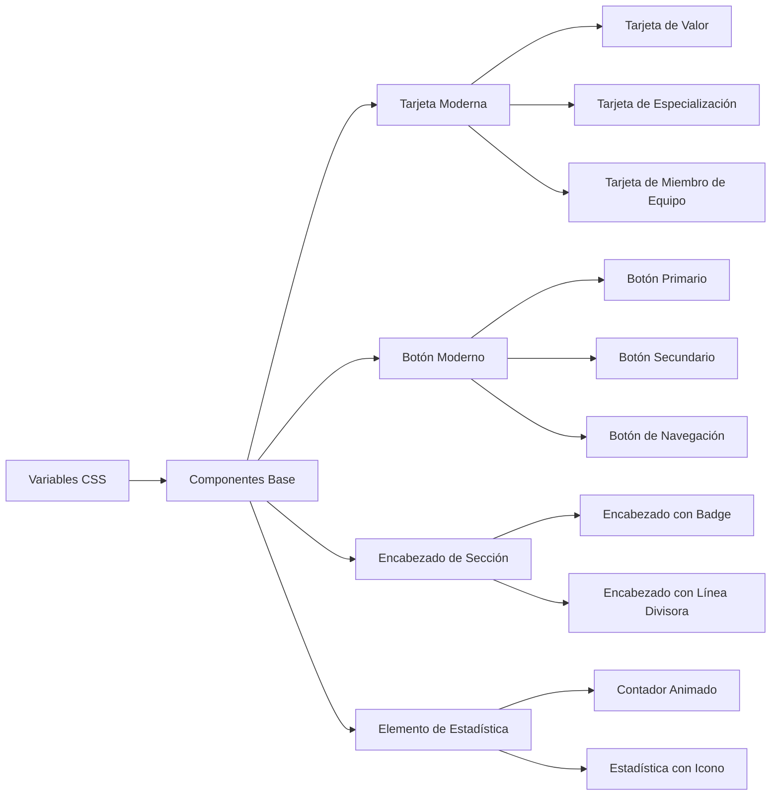

# Diagrama de Flujo - Estructura Propuesta para about.php Modernizada

```mermaid
graph TD
    A[about.php] --> B[header.php]
    A --> C[Hero Section Modernizada]
    A --> D[Sección Quiénes Somos]
    A --> E[Sección Misión y Visión]
    A --> F[Sección Nuestros Valores]
    A --> G[Sección Nuestro Equipo]
    A --> H[Sección Nuestra Historia]
    A --> I[Sección Especializaciones Mejorada]
    A --> J[Sección CTA Modernizada]
    A --> K[footer.php]
    
    C --> C1[Título Principal con Animación]
    C --> C2[Subtítulo Descriptivo]
    C --> C3[Breadcrumb de Navegación]
    C --> C4[Elementos Visuales Flotantes]
    
    D --> D1[Imágenes Principales con Efectos Parallax]
    D --> D2[Texto Descriptivo de la Empresa]
    D --> D3[Estadísticas Animadas]
    D --> D4[Elementos Visuales Interactivos]
    
    E --> E1[Tarjeta de Misión con Icono Animado]
    E --> E2[Tarjeta de Visión con Icono Animado]
    E --> E3[Texto sobre Misión]
    E --> E4[Texto sobre Visión]
    
    F --> F1[Grid de Valores]
    F --> F2[Tarjeta de Innovación]
    F --> F3[Tarjeta de Excelencia]
    F --> F4[Tarjeta de Compromiso]
    F --> F5[Tarjeta de Integridad]
    
    G --> G1[Galería de Miembros del Equipo]
    G --> G2[Tarjeta de Miembro 1]
    G --> G3[Tarjeta de Miembro 2]
    G --> G4[Tarjeta de Miembro 3]
    
    H --> H1[Línea de Tiempo Interactiva]
    H --> H2[Hito 1: Fundación]
    H --> H3[Hito 2: Primer Proyecto Importante]
    H --> H4[Hito 3: Expansión]
    H --> H5[Hito 4: Reconocimiento]
    
    I --> I1[Grid de Especializaciones]
    I --> I2[Tarjeta de IA]
    I --> I3[Tarjeta de IoT]
    I --> I4[Tarjeta de Ciberseguridad]
    I --> I5[Tarjeta de Servidores en la Nube]
    I --> I6[Tarjeta de Aplicaciones Móviles]
    I --> I7[Tarjeta de Análisis de Datos]
    I --> I8[Tarjeta de Automatización]
    
    J --> J1[Título Atractivo con Gradiente]
    J --> J2[Descripción del CTA]
    J --> J3[Botón Primario con Efecto Hover]
    J --> J4[Botón Secundario con Efecto Hover]
```



# Componentes CSS Reutilizables



# Flujo de Implementación

```mermaid
graph TD
    A[Inicio] --> B[Preparación]
    B --> C[Desarrollo Estructural]
    C --> D[Desarrollo Visual]
    D --> E[Contenido y Traducciones]
    E --> F[Interactividad y UX]
    F --> G[Pruebas y Optimización]
    G --> H[Lanzamiento]
    
    B --> B1[Backup de about.php]
    B --> B2[Creación de Estructura de Archivos]
    B --> B3[Preparación de Assets]
    
    C --> C1[HTML Semántico]
    C --> C2[Variables CSS]
    C --> C3[Sistema Grid]
    
    D --> D1[Hero Section]
    D --> D2[Secciones Principales]
    D --> D3[Animaciones y Efectos]
    
    E --> E1[Contenido Traducible]
    E --> E2[Archivos de Idioma]
    E --> E3[Funcionalidad Multiidioma]
    
    F --> F1[JavaScript]
    F --> F2[Animaciones AOS]
    F --> F3[Interacciones]
    
    G --> G1[Pruebas de Responsividad]
    G --> G2[Pruebas de Compatibilidad]
    G --> G3[Optimización de Rendimiento]
    G --> G4[Pruebas de Accesibilidad]